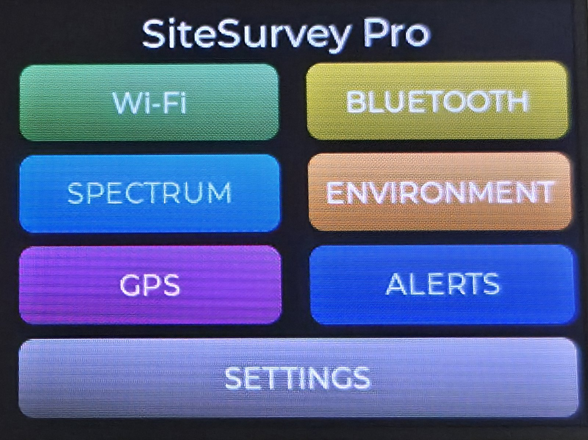
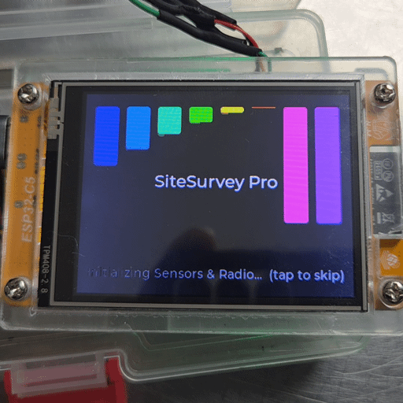
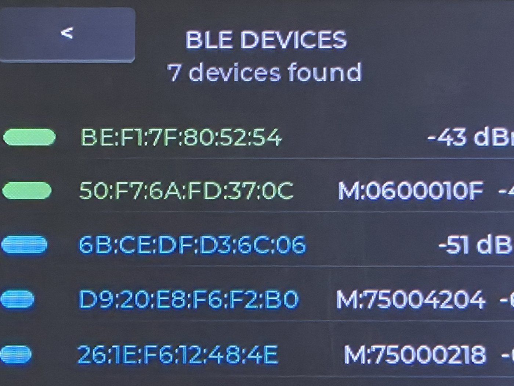
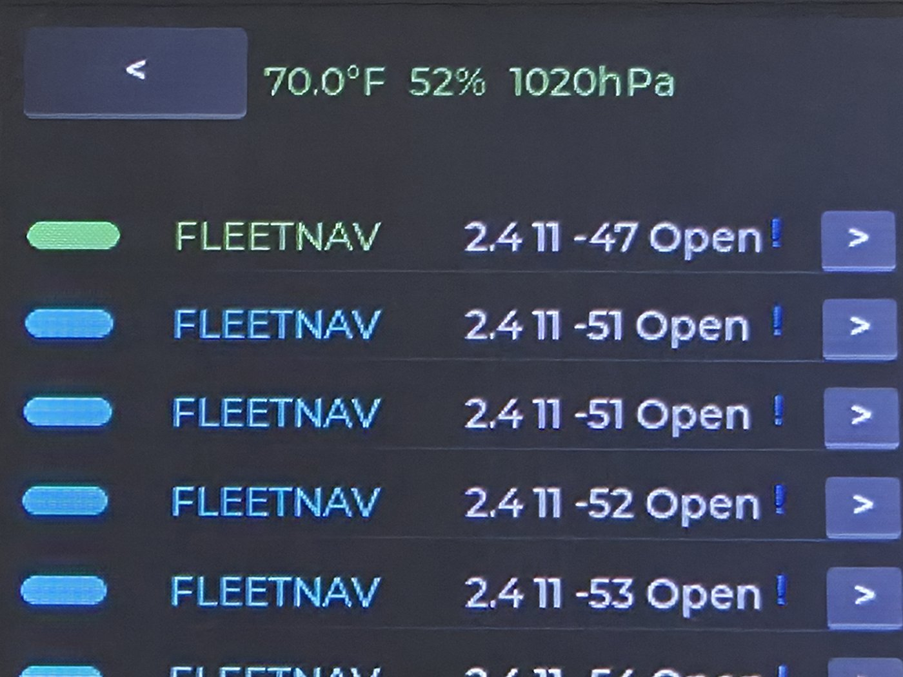
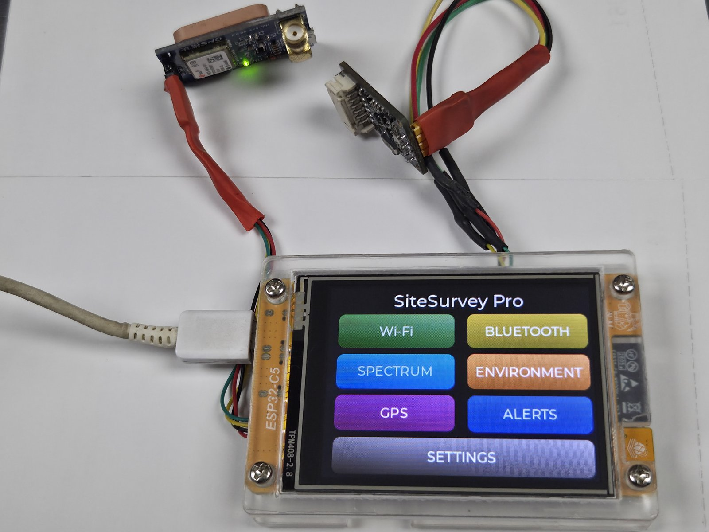

# SiteSurvey Pro — Guition NM-CYD-C5 (ESP32-C5)

> Standalone dual-band Wi-Fi 6 site-survey and RF diagnostics tool, built
> entirely in C on ESP-IDF + FreeRTOS + LVGL — no laptop, no cloud, no phone app.



**Board:** Guition **NM-CYD-C5** — ESP32-C5 development board with a 2.8" ST7789
touchscreen (ESP32-C5-WROOM-1 module, 16 MB flash, 8 MB PSRAM).
Source: https://github.com/RockBase-iot/NM-CYD-C5

## Features

| | |
|---|---|
| **Dual-band Wi-Fi scanning engine** | Active scans across 2.4 GHz and 5 GHz, RSSI history per BSSID, tiered signal-strength colouring, strongest-first sorting, and **evil-twin (rogue AP) detection** — same SSID, different BSSID gets flagged automatically. |
| **Per-AP signal graph** | Tap any network for a live RSSI chart (now/min/max/avg over a ~5-minute window) with severity-coloured trace. |
| **Bluetooth scan** | Companion BLE survey view alongside Wi-Fi. |
| **Spectrum view** | Channel-occupancy overview across both bands. |
| **BME680 telemetry** | Temperature, humidity, pressure, and VOC/gas index streamed live to the Environment screen; sensor rides the I²C header (CN1). |
| **GPS mapping** | NMEA GGA/RMC parsing (talker-agnostic), live fix on the GPS screen, and coordinates stamped into every logged observation; module plugs into the P5 UART header. |
| **Session logging** | One-touch CSV session logs and KML exports on micro SD — open the walk survey straight in a spreadsheet or Google Earth. |
| **Alert engine** | Configurable SSID-target and RSSI-threshold alerts with on-screen log and RGB LED feedback; targets persist in NVS. |
| **OTA updates** | Flash new firmware from the SD card, no cable required. |
| **Pure C, no IDE** | ESP-IDF v6.1, FreeRTOS task-per-subsystem, LVGL 9 on a shared SPI bus. |

<!-- Boot-to-splash demo (22 frames, device capture) — lives at docs/assets/demo.gif -->


## Hardware Setup

The NM-CYD-C5 carries the display, touch, and SD card on the factory-shared SPI
bus — nothing to wire there. Two optional sensors plug into the board's headers:

| Sensor | Header | Connection |
|---|---|---|
| **BME680** (environment) | CN1 (I²C) | SCL → GPIO 8, SDA → GPIO 9, 3V3 + GND |
| **GPS module** (NMEA 9600) | P5 (UART) | GPS TX → GPIO 4, GPS RX → GPIO 5, 3V3 + GND |

### Pinout Reference

| Function | Signal | GPIO | Notes |
|----------|--------|------|-------|
| **Shared SPI** | SCK | 6 | 30 MHz display / SD, 2.5 MHz touch |
| | MISO | 2 | |
| | MOSI | 7 | |
| **ST7789 display** | CS | 23 | |
| | DC | 24 | |
| | BL | 25 | PWM backlight |
| | RST | — | Chip-level reset (no GPIO) |
| **XPT2046 touch** | CS | 1 | Shared SPI bus |
| **Micro SD** | CS | 10 | Shared SPI bus |
| **GPS (P5)** | RX | 4 | GPS TX → ESP RX (LP-UART) |
| | TX | 5 | ESP TX → GPS RX |
| **BME680 (CN1)** | SCL | 8 | I²C 100 kHz |
| | SDA | 9 | |
| **RGB LED** | Data | 27 | WS2812, GRB |

## Gallery

| Bluetooth survey | Evil-twin detection in the field | Hardware rig |
|---|---|---|
|  |  |  |
| BLE observer mode — MAC, name fragment, live dBm per device. | Two `FLEETNAV` APs on the same SSID flagged as a potential evil twin, BME680 overlay on top. | Full rig: board on USB power, GPS module on P5, BME680 on CN1. |

## Installation

### Option A — flash a release (no toolchain needed)

Download the `SiteSurvey-Pro.bin` assets from the
[latest release](https://github.com/bigjoe420/SiteSurvey-Pro/releases), then
either use [esptool-js](https://espressif.github.io/esptool-js/) in the browser
or `esptool.py`:

```bash
esptool.py --chip esp32c5 write-flash \
  0x2000  bootloader.bin \
  0x8000  partition-table.bin \
  0x10000 SiteSurvey-Pro.bin
```

### Option B — build from source (ESP-IDF v6.1)

Requires [ESP-IDF v6.1](https://docs.espressif.com/projects/esp-idf/) with the
RISC-V toolchain installed (Ubuntu 24.04 LTS or Windows 11 + ESP-IDF PowerShell).

```bash
git clone https://github.com/bigjoe420/SiteSurvey-Pro.git
cd SiteSurvey-Pro

idf.py set-target esp32c5   # one-time
idf.py build
idf.py -p /dev/ttyUSB0 flash monitor      # Linux
idf.py -p COM3 flash monitor              # Windows
```

> Windows + Git Bash: `idf.py` is refused under MSYSTEM on ESP-IDF v6.1 —
> use `python idf_run.py build` / `python idf_run.py -p COM3 flash` instead.

## System Architecture

```
┌─────────────────────────────────────────────────────────────────────────────┐
│                              SiteSurvey Pro                                  │
│  FreeRTOS Task Architecture                                                   │
├─────────────────────────────────────────────────────────────────────────────┤
│                                                                             │
│   ┌─────────────┐      scan_queue      ┌─────────────┐     gui_queue      ┌───────────┐
│   │ wifi_scan   │ ───────────────────► │             │ ─────────────────► │           │
│   │   task      │   (fixed 16 slots)   │             │   (fixed 4 slots)  │  ui_task  │
│   └─────────────┘                      │             │                    │  (LVGL)   │
│                                        │   main_task │                    └─────┬─────┘
│   ┌─────────────┐      env_queue       │  (event     │                          │
│   │  sensor     │ ───────────────────► │   loop)     │                          │
│   │   task      │   (fixed 8 slots)    │             │                          │
│   │ (BME680 +   │                      │             │                    ┌─────┴─────┐
│   │   GPS)      │                      └─────────────┘                    │  ST7789   │
│   └─────────────┘                                                         │   + XPT   │
│                                                                           │  (SPI)    │
└───────────────────────────────────────────────────────────────────────────┴───────────┘
```

| Task | Priority | Duty |
|------|----------|------|
| `ui_task` | 3 | LVGL `lv_timer_handler()` tick + render. Consumes `gui_queue`. |
| `wifi_scan_task` | 2 | Active scan loops (2.4/5 GHz). Posts `ScanResult_t` to `scan_queue`. |
| `sensor_task` | 2 | BME680 poll (≥ 1 Hz), GPS NMEA parse. Posts `EnvSnapshot_t` to `env_queue`. |
| `main_task` | 2 | Event loop: consumes queues, updates model, pushes `GuiUpdate_t` to `gui_queue`. |

## Project Structure

```
SiteSurvey-Pro/
├── CMakeLists.txt              # Root project (target esp32c5, PROJECT_VER 1.0.0)
├── sdkconfig.defaults          # Mandatory Kconfig (target, flash, PSRAM)
├── partitions/
│   └── partitions.csv          # 16MB custom layout
├── main/
│   ├── CMakeLists.txt          # Component registration
│   ├── main.cpp                # FreeRTOS init + task creation
│   ├── include/
│   │   ├── board_pins.h        # Canonical pin macros
│   │   └── ssp_timefmt.h       # Shared timestamp helper
│   ├── ui/                     # LVGL screens (home, wifi, ble, env, spectrum,
│   │                           # gps, alerts, settings) + theme + LVGL port
│   ├── scan_engine/            # Dual-band active scan, AP pool, filters
│   ├── ble/                    # Bluetooth scan
│   ├── sensors/                # BME680, GPS, sensor fusion task
│   ├── storage/                # SD card, session CSV logger, KML/report export
│   ├── alerts/                 # Alert engine (NVS-backed targets)
│   ├── ota/                    # SD-card OTA update
│   ├── power/ led/ flash/      # Power manager, WS2812 LED, flash broker
│   └── display/ touch/         # ST7789 panel, XPT2046 touch
├── docs/
│   ├── assets/                 # README media (hero, demo.gif, gallery-*)
│   └── datasheets/             # Hardware datasheets
└── tools/                      # Build/flash helpers + diagnostic scripts
```

## License

[MIT](LICENSE) — do what you like, keep the notice.
